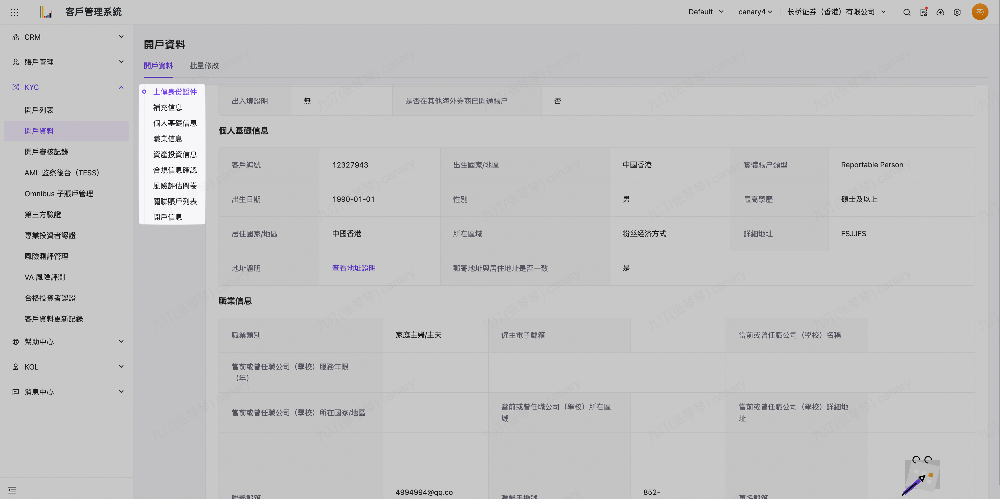

# 開戶資料

# 適用場景

- 本作業是開戶資料的後台申請入口，同時也可以查到相關客戶的前端APP開戶填寫資料與協助補錄資料
- 適用於：
    - 全新開戶的資料申請錄入或修改資料
    - 多開通證劵帳戶申請
    - 多開通證劵子帳戶申請
    - 批次修改證劵帳戶

# 前置条件

无

# 操作說明

## 開戶資料

 菜單入口：KYC > 開戶資料 

點選 右側紀錄操作區【詳情】可以查閱 客戶填寫的開戶詳細資料：包含身份證件/個人訊息/職業訊息/資產投資經驗/合規信息等等， 可以透過左側樹狀 切換資料數據區域

點選 右側紀錄操作區【編輯】可以編輯 客戶填寫的開戶詳細資料：基本上依序操作：

接下來上傳開戶文件， 其中必要文件有：開户申請表/W-8BEN 表格/HKIDR PDF 文件，

同時填寫完必要欄位： 見證員工/開通帳戶類型與計費類別/ 是否標記帳戶類型，填寫後就完成開戶帳戶申請資料提交，後續就等待 劵商對申請資料做開戶審批等 KYC 操作

## 場景：全新開戶資料錄入

[全新開戶申請資料錄入](https://longbridge.feishu.cn/wiki//Oh1ww4GN8iB9iZktgHKcQWwln2f/xxx/xxx/xxx/xxx?create_from=create_doc_to_wiki)

## 場景：多開通證劵帳戶申請

[多開證劵帳戶申請](https://longbridge.feishu.cn/wiki//zh-HK/guides/crm/kyc/open-account/xxx)

## 場景：多開通證劵子帳戶申請

[多開證劵子帳戶申請](https://longbridge.feishu.cn/wiki//zh-HK/guides/crm/kyc/open-account/xxx)

## 場景：批量修改證劵帳戶

[批量修改證劵帳戶](https://longbridge.feishu.cn/wiki//zh-HK/guides/crm/kyc/open-account/xxx)

