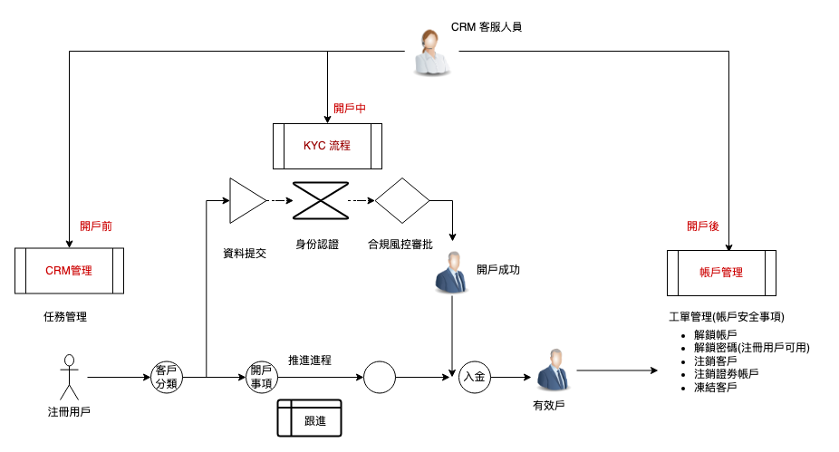

# 客户管理系统（CRM)

 此页面根据 整个系统 重点功能 或 销售术语 来编写文档内容

<ol>
<li>若可以则搭配一个 全局的 系统流程图来说明 主要业务走向 ********  此区域 将会 删除 *************</li>
</ol>

Whale CRM 客户管理系统是以全新整合角度，方便劵商客务团队来管理服务劵商客户，包括：

**客户生命周期管理**、**客户 ****KYC**** 资料审核**及**帐户风险管理**** **等。

Whale CRM 系统能够解决以下问题： 

1. 客户资讯分散：客户基础资讯、KYC 资料、业务数据分散在 Excel 表格、记事本及电子邮件中；没有一个资料库可以存储客户全部资讯 
2. 团队协作繁琐：跨团队合作，协作效率低；没有标准化流程 
3. 风险监控滞后：未建立持续即时的风险监控机制；无法有效履行监管义务并及时采取措施 
4. 业务管理靠人工：任务分配与统计，未自动化；管理人员的效率不高

同时在核心开户业务上，Whale CRM 系统的设计中，是将开户业务三种前中后环结同步在一起，对开户活动作全方位管理：

- 开户前：从注册用户至有效户的推动进程管理 (CRM 管理)
- 开户中：开户资料提交后 KYC 审核流程 (KYC 流程)
- 开户后 :开户后帐户安全的工单管理 (帐户管理)

Whale CRM 的整体业务流如下图所示：

