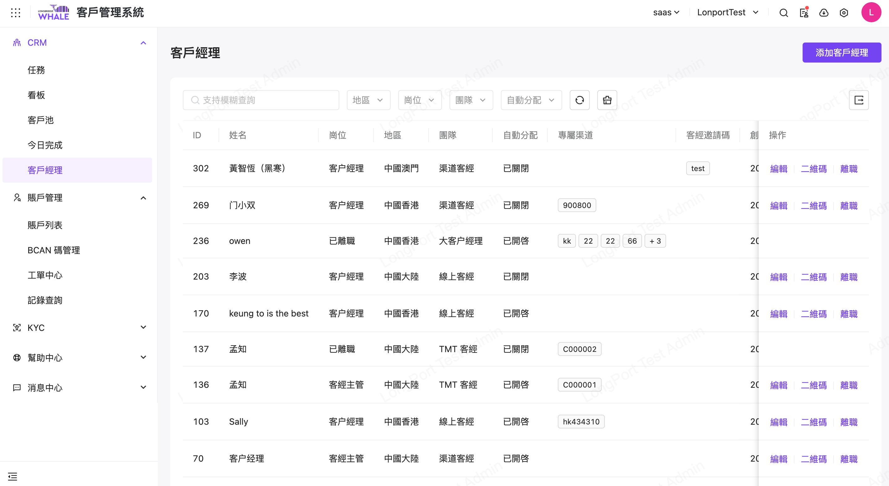
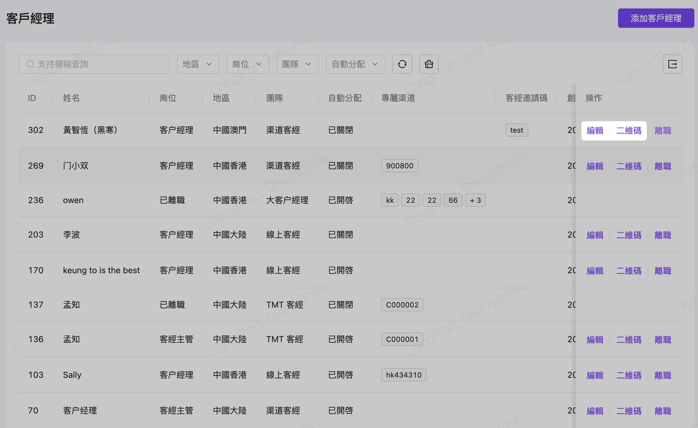
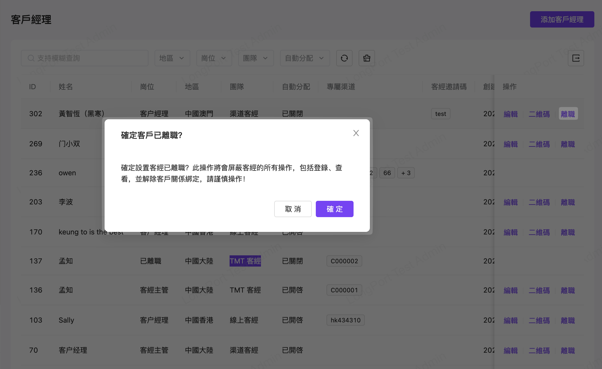

# 客户经理

## 适用场景

本作业主要用于维护管理 CRM 相关客务团队的职务人员的基础信息

## 前置条件

无

## 操作说明

菜单入口：客户管理系统>CRM>客户经理

本作业可以维护管理 CRM 相关客务团队职务人员，包括客户经理的增删改查、二维码、离职等信息

点击【添加客户经理】，新增一个 CRM 客户经理相关栏位说明

也可以在纪录右侧操作区：进行【编辑】或著点选【二维码】来增加个人社交帐号相关讯息

同时若客户经理离职，也可针对该笔记录作【离职】处理

