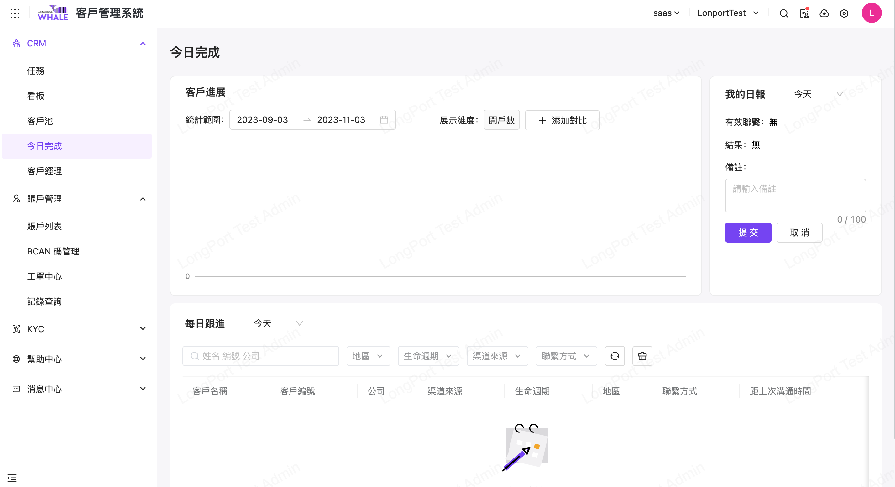

# 今日完成

## 适用场景

本作业将客户管理所推动有效户目标推进时的进程节点，提供多种维度图型对比

## 前置条件

无

## 操作说明

菜单入口：客户管理系统>CRM>今日完成

主要展示客户进展、每日跟进、我的日报三个维度的信息。

关于客户进展，提供多种维度图型对比（开户数/入金数/待开户跟进数/待入金跟进数/TMT 注册跟进数/已入金跟进数）

每日跟进，支持在作业中间区域根据筛选条件查询出需要跟进的用户（客户）记录

右上角区域也提供日报记录的功能，方便客务人员记录日报摘要

