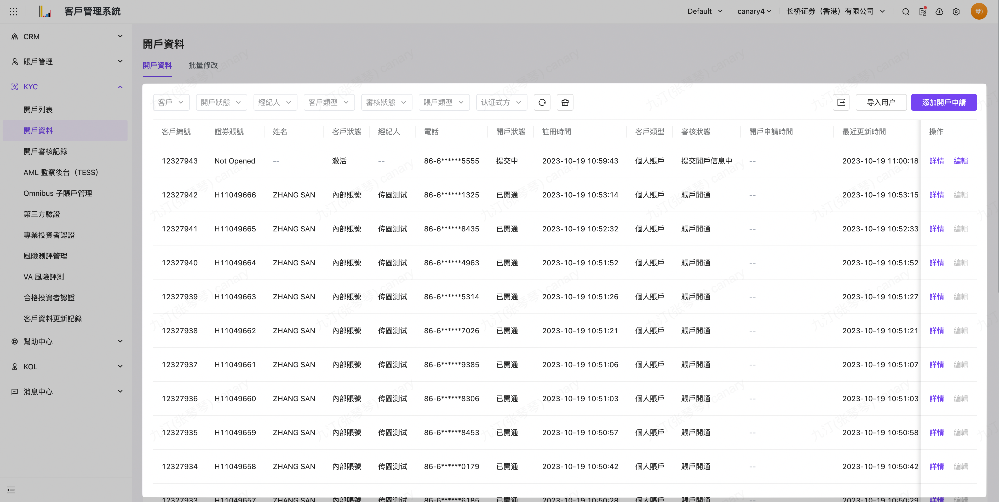

# 开户资料

## 适用场景

- 本作业是开户资料的后台申请入口，同时也可以查到相关客户的前端APP开户填写资料与协助补录资料
- 适用于：
    - 全新开户的资料申请录入或修改资料
    - 多开通证劵帐户申请
    - 多开通证劵子帐户申请
    - 批次修改证劵帐户

## 前置条件

无

## 操作说明

## 开户资料

 菜单入口：KYC > 开户资料 

点选 右侧纪录操作区【详情】可以查阅 客户填写的开户详细资料：包含身份证件/个人讯息/职业讯息/资产投资经验/合规信息等等， 可以透过左侧树状 切换资料数据区域

点选 右侧纪录操作区【编辑】可以编辑 客户填写的开户详细资料：基本上依序操作：

接下来上传开户文件， 其中必要文件有：开户申请表/W-8BEN 表格/HKIDR PDF 文件，

同时填写完必要栏位： 见证员工/开通帐户类型与计费类别/ 是否标记帐户类型，填写后就完成开户帐户申请资料提交，后续就等待 劵商对申请资料做开户审批等 KYC 操作

### 场景：全新开户资料录入

[全新开户申请资料录入](https://longbridge.feishu.cn/wiki//Oh1ww4GN8iB9iZktgHKcQWwln2f/xxx/xxx/xxx/xxx?create_from=create_doc_to_wiki)

### 场景：多开通证劵帐户申请

[多开证劵帐户申请](https://longbridge.feishu.cn/wiki//zh-HK/guides/crm/kyc/open-account/xxx)

### 场景：多开通证劵子帐户申请

[多开证劵子帐户申请](https://longbridge.feishu.cn/wiki//zh-HK/guides/crm/kyc/open-account/xxx)

### 场景：批量修改证劵帐户

[批量修改证劵帐户](https://longbridge.feishu.cn/wiki//zh-HK/guides/crm/kyc/open-account/xxx)

