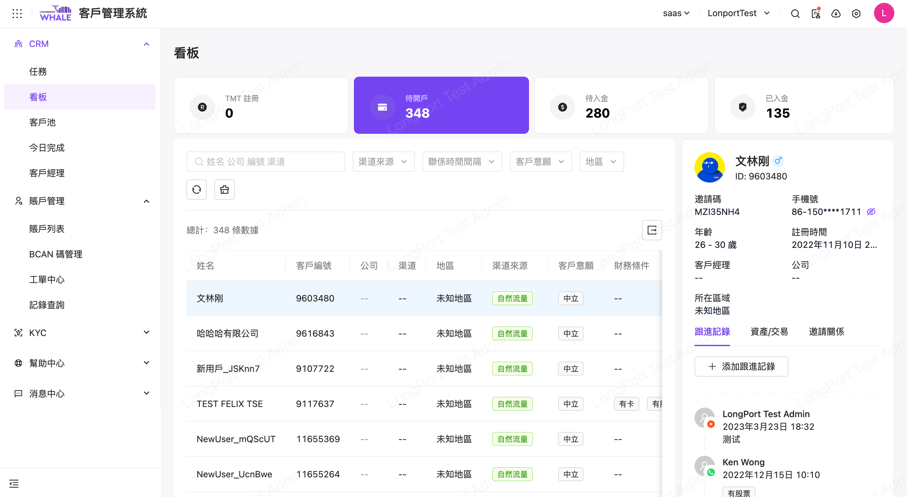
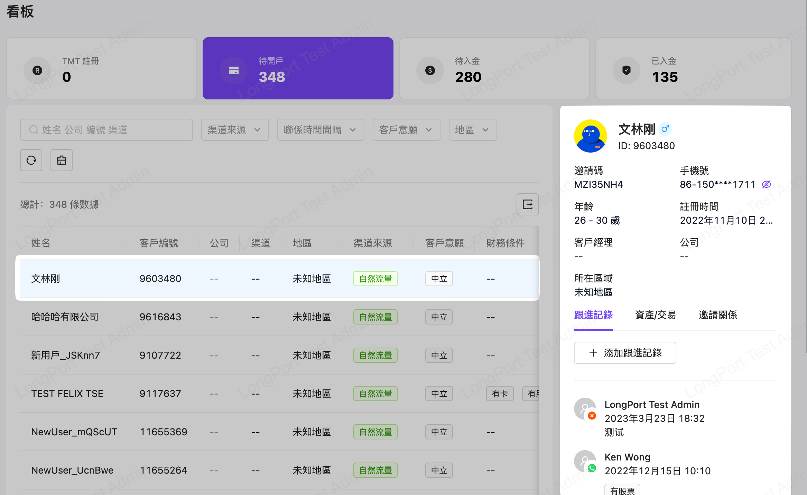
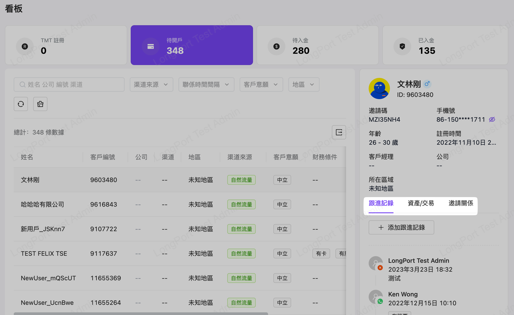

# 看板

## 適用场景

匯總成為有效客戶前的幾個重要節點的數據，幫助客戶經理快速獲取信息，更高效的轉化客戶

## 前置条件

菜單“任務”頁，有錄入客戶數據

## 操作说明

菜單入口：客戶管理系統>CRM>看板

以 Dash-board 的方式展現成為有效客戶前的幾個重要節點匯總數據，如注冊、待開戶、待入金、已入金

同時在切換節點數據時，中間區域也會同步展示該節點的用戶（客戶）表列記錄

點選不同表列記錄時，右側卡式訊息也會同步變更展示

有需要時也可在用戶（客戶）Tab 頁簽上，錄入【跟進記錄】與查看【資產/交易】相關

