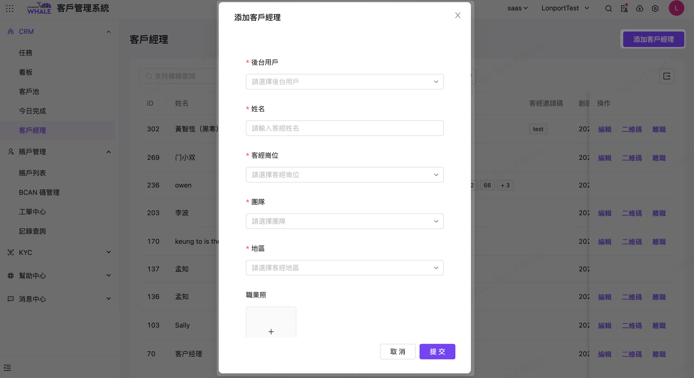

# 客户经理

## 適用场景

本作業主要用於維護管理 CRM 相關客務團隊的職務人員的基礎信息

## 前置条件

無

## 操作说明

菜單入口：客戶管理系統>CRM>客戶經理

本作業可以維護管理 CRM 相關客務團隊職務人員，包括客戶經理的增刪改查、二維碼、離職等信息

點擊【添加客戶經理】，新增一個 CRM 客戶經理相關欄位說明

也可以在紀錄右側操作區：進行【編輯】或著點選【二維碼】來增加個人社交帳號相關訊息

同時若客戶經理離職，也可針對該筆記錄作【離職】處理

