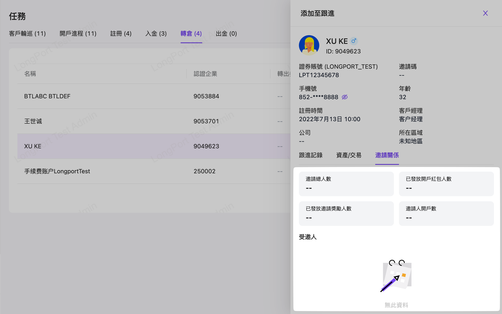

# 任務

## 適用场景

本作業將客戶管理從完成從新用戶轉成一個有效戶的目標推進過程中，以集成匯總與附予任務方式來管理每個與用戶（客戶）的互動進程，每個進程都可以方便追蹤管理，同時在跟進（記錄互動）時也是以卡片方式來展是用戶（客戶）的全局記錄

## 前置条件

無

## 操作说明

菜單入口：客戶管理系統>CRM>任務

每個不同的互動進程的信息展示。例如，入金/出金/注冊等。

可在右側記錄操作區：【跟進】，點擊後會進入該用戶（客戶）的卡式資料展示。

上部份展示簡單資料與客戶經理資料：

點擊【跟進記錄】Tab 頁籤，錄入標註一些 CRM 常規的互動標籤說明

點擊【資產/交易】Tab 頁籤，查看客戶資產總覽與近期出入金記錄

點擊【邀請關係】Tab 頁籤，查看邀請關係

