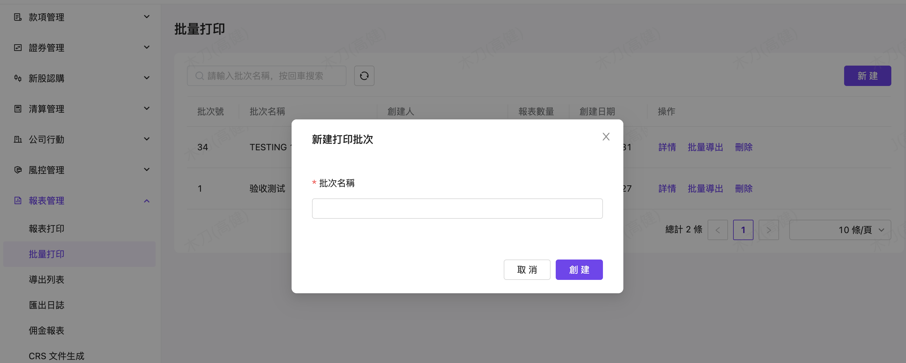
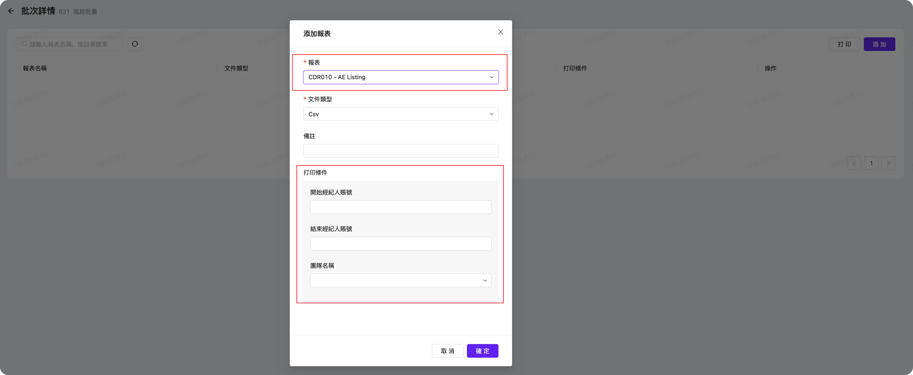
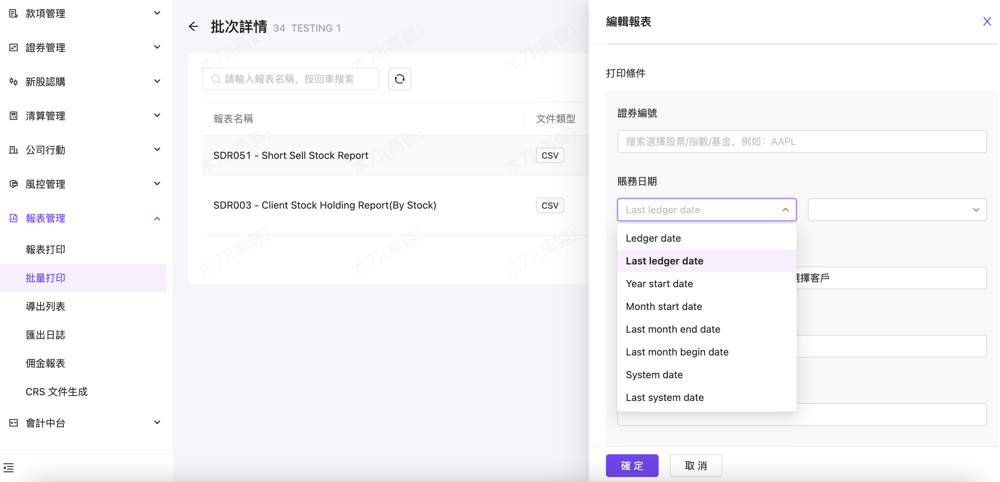

# 批量打印

### 批量打印操作

 批量打印涉及作業權限的開通，若尚未開通權限，可以在共同介面：審批>新建工單>權限申請工單上，提交批量打印權限

#### 批量打印（設置）

-  （系統 10/31 新增功能）: 系統也支持批量打印報表功能，可以自行新增一個批量作業，點選右上方【新增】，增加批量打印名稱與批量報表組成

批量打印名稱確認後，可以添加批量的報表組成（選報表名稱/打印方式），打印條件會根據不同報表，自動顯示相關欄位，可以根據需要自行設置

- 同時根據不同的報表條件欄位，也可以設制不同條件：在批次詳情面，點擊【添加】進入報表添加设置頁面，選擇報表并設置報表條件

 例：如果是日期则如下选择项：

- ledger date    當前帳務日期  
- Last ledger date 上一个帳務日期
- year start date     年初第一天
- month start date    本月初第一天
- last month end date   上月最后一天
- last month begin date 上月最后一天
- system date  當前自然日
- last system date 上一自然日
- Before last ledger date 上上一个帳務日期
- Before last system date 上上一自然日

單一報表也可以進行下列操作：

1. 列表內點擊【修改】進入報表條件修改頁面
2. 列表內點擊【導出】可以按條件導出單個報表
3. 列表內點擊【刪除】可以移除批次中的報表

 （系統 01/30 :新增功能）報表批量打印同一批次支持添加相同的報表，方便相同報表但列印參數不同需要

#### 批量打印

- 也可以在現有批量作業紀錄右側區，操作【查看詳情】或【批量導出】

若批量導出執行後，可以在導出列表作業上查看，也可以將文件夾整個下載操作

可以點選詳情，查看每一批量打印的單一報表，或單一報表下載

